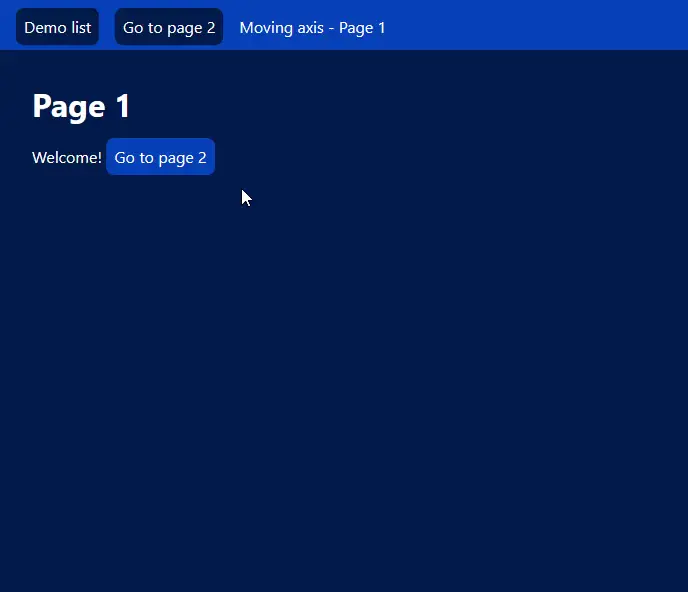

# View Transitions API polyfill

A polyfill for the [View Transitions API](https://drafts.csswg.org/css-view-transitions/).

The polyfill is [available on NPM](https://www.npmjs.com/package/view-transitions-polyfill).

## Demo

View some [demos showing example transitions](https://demarketed.github.io/view-transitions-polyfill/).



## Installation

Install the polyfill in your project from [NPM](https://www.npmjs.com/package/view-transitions-polyfill):

```
npm install view-transitions-polyfill
```

## Usage

Import the module into your site.

Inside a script:

```js
import 'view-transitions-polyfill';
```

Or from the HTML:

```html
<script type="module">
  import 'view-transitions-polyfill';
</script>
```

## Compatibility

The polyfill currently requires the browser to support these notable features:

- [Element.animate()](https://developer.mozilla.org/en-US/docs/Web/API/Element/animate)
- [Document.getAnimations()](https://developer.mozilla.org/en-US/docs/Web/API/Document/getAnimations)
- [requestAnimationFrame()](https://developer.mozilla.org/en-US/docs/Web/API/Window/requestAnimationFrame)
- Custom elements
- Shadow DOM
- [CSS :where() selector](https://developer.mozilla.org/en-US/docs/Web/CSS/:where)
- [Array.findLast()](https://developer.mozilla.org/en-US/docs/Web/JavaScript/Reference/Global_Objects/Array/findLast)

### With Astro View Transitions

You can use the polyfill with [Astro view transitions](https://docs.astro.build/en/guides/view-transitions/) by importing the script in the document as you would normally. For example, within a component:

```html
<script src="view-transitions-polyfill"></script>
```

## Development

### Building

Build the polyfill to `dist`:

```
npm run build
```

### Testing

To test the polyfill, you can run [Web Platform Tests](https://web-platform-tests.org/index.html).
You need to [set up your system](https://web-platform-tests.org/running-tests/from-local-system.html) before running tests.

Run the tests with:

```
npm run test
```

This will generate report files in `test/report`.

The polyfill only loads its functions into the browser if it does not already natively support the View Transitions API.
You can run the tests with a version of the polyfill that avoids this check with:

```
npm run test-always-polyfill
```

You can view the tests' web pages in your browser with:

```
npm run test-debug
```
